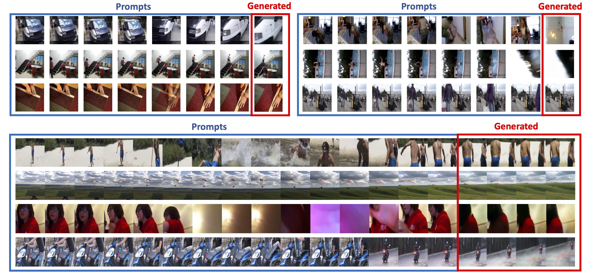
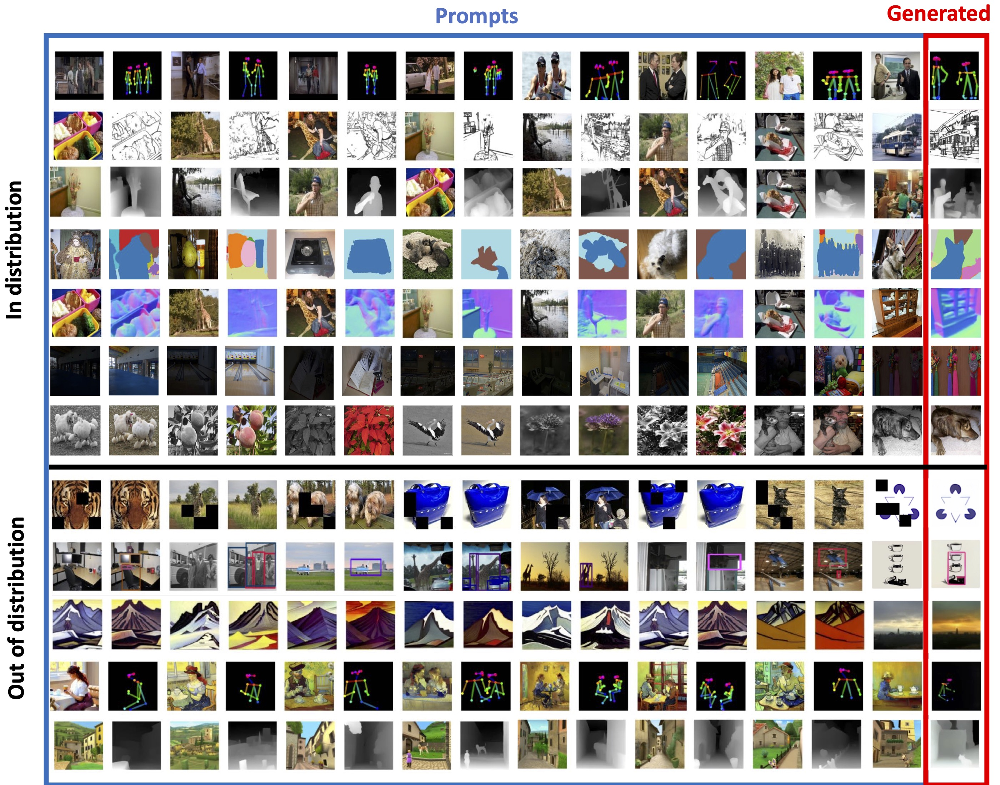
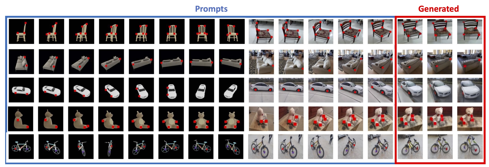
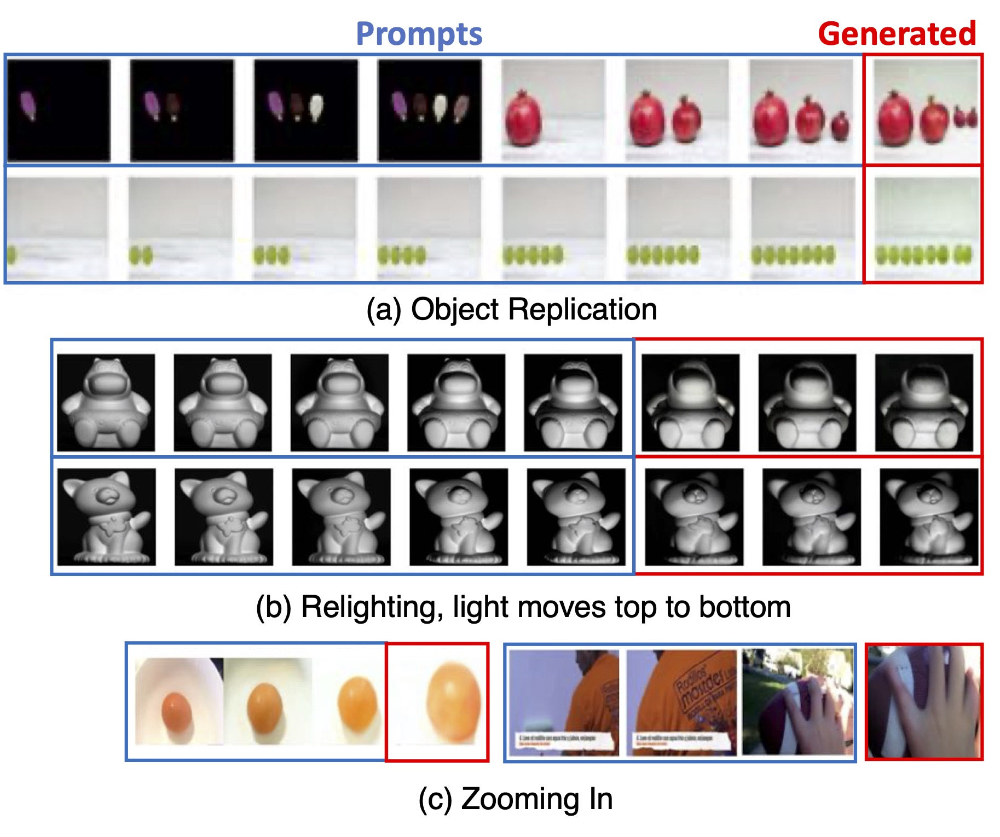
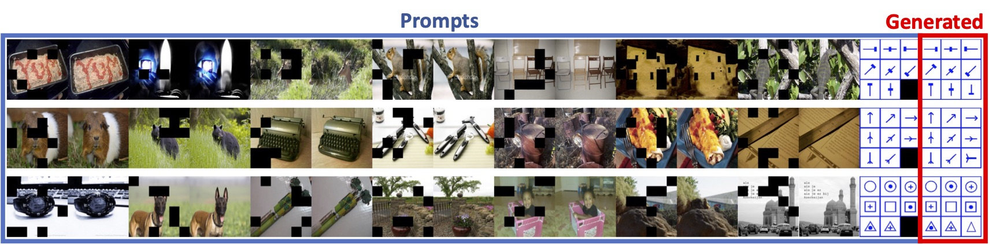

# Sequential Modeling Enables Scalable Learning for Large Vision Models

Welcome to the official repository for our paper: "Sequential Modeling Enables Scalable Learning for Large Vision Models."

[Visit our project webpage](https://yutongbai.com/lvm.html)

## Abstract:

We introduce a novel sequential modeling approach which enables learning a Large Vision Model (LVM) without making use of any linguistic data. 
To do this, we define a common format, ``visual sentences", in which we can represent raw images and videos as well as annotated data sources such as semantic segmentations and depth reconstructions without needing any meta-knowledge beyond the pixels.  Once this wide variety of visual data (comprising 420 billion tokens) is represented as sequences, the model can be trained to minimize a cross-entropy loss for next token prediction. By training across various scales of model architecture and data diversity, we provide empirical evidence that our models scale effectively. Many different vision tasks can be solved by designing suitable visual prompts at test time. 

## Visual Sentence

  

## What Can It Do? 

  

  

  

  

  

  

## Coming Soon!

We are in the process of preparing the code, models, and datasets for release. Stay tuned for updates and additional resources!

