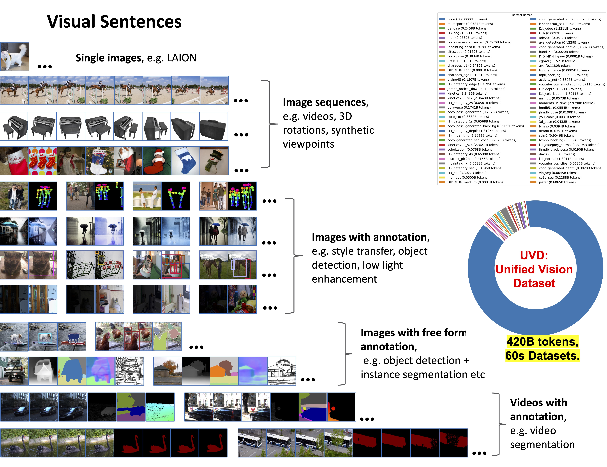

# LVM: Sequential Modeling Enables Scalable Learning for Large Vision Models

[LVM](https://arxiv.org/abs/2312.00785) is a vision pretraining model that converts various kinds of visual data into visual sentences and performs next-token prediction autoregressively. It is compatible with both GPU and TPU.

LVM is built on top of [OpenLLaMA](https://github.com/openlm-research/open_llama) (an autoregressive model) and [OpenMuse](https://github.com/huggingface/open-muse) (a VQGAN that converts images into visual tokens).

This was trained in collaboration with HuggingFace. Thanks [Victor Sanh](https://github.com/VictorSanh) for the support in this project.

## Abstract:

We introduce a novel sequential modeling approach which enables learning a Large Vision Model (LVM) without making use of any linguistic data. 
To do this, we define a common format, ``visual sentences", in which we can represent raw images and videos as well as annotated data sources such as semantic segmentations and depth reconstructions without needing any meta-knowledge beyond the pixels.  Once this wide variety of visual data (comprising 420 billion tokens) is represented as sequences, the model can be trained to minimize a cross-entropy loss for next token prediction. By training across various scales of model architecture and data diversity, we provide empirical evidence that our models scale effectively. Many different vision tasks can be solved by designing suitable visual prompts at test time. 

## Visual Sentence

<div align="center">
  
</div>


## Key Differences from the Original Paper Version
1. We are currently releasing the 7B model (previously 3B). Additional model size variants will be available later.
2. Deep filtering (including quality filters, deduplication, and known CSAM content removal) has been applied to the LAION dataset, reducing the dataset size from 1.5B to 1.2B images.

3. The tokenizer has been improved for better performance.

## License
LVM is licensed under the Apache 2.0 License.

## Installation
```shell
git clone https://github.com/ytongbai/LVM
cd LVM
export PYTHONPATH="\${PWD}:\$PYTHONPATH"
```

## Environment Setup
```shell
conda env create -f scripts/gpu_environment.yml
conda activate LVM
```

## Dataset Preparation
Please refer to \`DATASET.md\` for detailed instructions on preparing the dataset.

After preparing the dataset, you will get a pretokenized file \`dataset.jsonl\`.

## Training Script

We provide an example training script for 7B model, for more details about the distributed training setting, please refer to [EasyLM](https://github.com/young-geng/EasyLM).

For other model size, we provide the model definition from 100M, 300M, 600M, 1B, 3B, 7B, 13B, 20B to 30B in './EasyLM/models/llama/llama_model.py' .


```shell
python -u -m EasyLM.models.llama.llama_train \
    --jax_distributed.initialize_jax_distributed=True \
    --jax_distributed.coordinator_address='$MASTER_ADDR:$MASTER_PORT' \
    --jax_distributed.local_device_ids='0,1,2,3,4,5,6,7' \
    --mesh_dim='$SLURM_NNODES,-1,1' \
    --dtype='bf16' \
    --total_steps=400000 \ # change according to the number of data
    --log_freq=10 \
    --save_model_freq=1000 \
    --save_milestone_freq=2000 \
    --load_llama_config='vqlm_7b' \
    --optimizer.type='adamw' \
    --optimizer.adamw_optimizer.weight_decay=0.1 \
    --optimizer.adamw_optimizer.lr=1.5e-4 \
    --optimizer.adamw_optimizer.end_lr=3e-5 \
    --optimizer.adamw_optimizer.lr_warmup_steps=8000 \
    --optimizer.adamw_optimizer.lr_decay_steps=288000 \
    --optimizer.accumulate_gradient_steps=4 \
    --train_dataset.type='json' \
    --train_dataset.text_processor.fields=',{tokens},' \
    --train_dataset.json_dataset.path='/path/to/dataset.jsonl' \
    --train_dataset.json_dataset.seq_length=4096 \
    --train_dataset.json_dataset.batch_size=32 \
    --train_dataset.json_dataset.tokenizer_processes=16 \
    --checkpointer.save_optimizer_state=True \
    --logger.online=True \
    --logger.output_dir='/path/to/checkpoint/$RUN_NAME' \
    --logger.wandb_dir='/path/to/wandb' \
    --logger.notes='' \
    --logger.experiment_id=$EXPERIMENT_ID
```

## Convert to Huggingface checkpoint

```shell
python -m EasyLM.models.llama.convert_easylm_to_hf --load_checkpoint='trainstate_params::/path/to/checkpoint/streaming_train_state' --model_size='vqlm_7b' --output_dir='/path/to/output/checkpoint/'
```

## Demo & Inference

Download the [few-shot examples dataset](https://livejohnshopkins-my.sharepoint.com/:f:/g/personal/ybai20_jh_edu/Ei0xiLdFFqJPnwAlFWar29EBUAvB0O3CVaJykZl-f11KDQ?e=Bx9SXZ).

There are mainly two visual prompting: sequential prompting and analogy prompting.

### Analogy Prompting: 
Describe the task with few-shot examples, which is pairs of (x, y) inputs where x is the input image and y the "annotated" image. And add one query image in the end. We provide more few-shot examples at [this link](https://livejohnshopkins-my.sharepoint.com/:f:/g/personal/ybai20_jh_edu/Ei0xiLdFFqJPnwAlFWar29EBUAvB0O3CVaJykZl-f11KDQ?e=Bx9SXZ), and you can simply change the query image in the end for testing.

### Sequential Prompting:
Input a sequence of continuous frames and let the model generate the next one. 


Check out our demo and additionaly inference code on HuggingFace Spaces: [LVM Demo](https://huggingface.co/spaces/Emma02/LVM)


## Evaluation

Check evaluation/EVAL.md

## Models
- [LVM Checkpoints](https://huggingface.co/Emma02/LVM_ckpts)
- [VQ-VAE Checkpoints](https://huggingface.co/Emma02/vqvae_ckpts)


## Finetuning

LVM is a pretraining model, without instruction tuning or other kinds of post-training. If you want a specific task, we recommend organizing the data into visual sentence format, then finetune with a smaller learning rate using the training script we provide.

## Citation
If you found LVM useful in your research or applications, please cite our work using the following BibTeX:

```bibtex
@article{bai2023sequential,
  title={Sequential modeling enables scalable learning for large vision models},
  author={Bai, Yutong and Geng, Xinyang and Mangalam, Karttikeya and Bar, Amir and Yuille, Alan and Darrell, Trevor and Malik, Jitendra and Efros, Alexei A},
  journal={arXiv preprint arXiv:2312.00785},
  year={2023}
}

```
